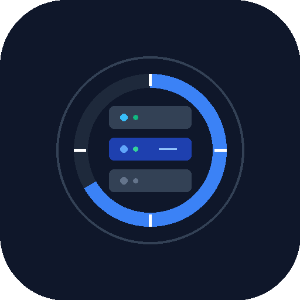

# Backup Planner



Backup Planner is a self-hosted web application for planning, visualizing, and improving backup strategies. It does **not** execute backups and never needs access to your files or backup credentials.

## Highlights

- weighted 3-2-1 protection score with actionable findings
- backup, synchronization, and archive plans
- hierarchical sites, buildings, rooms, and cloud locations
- week Gantt, three-month timeline, and agenda
- full master-data management for sources, targets, datasets, locations, and software
- English and German interface, light and dark themes
- portable JSON import/export and ten rotating server backups
- update checks on page load; installation remains CLI-only
- no accounts, telemetry, analytics, cookies, or external UI assets

## Requirements

- Debian or Ubuntu Linux
- a Proxmox LXC container or comparable server
- 1 GB RAM and 1 GB free disk space
- root access during installation
- access is intended for a trusted home network only

## Installation

```bash
git clone https://github.com/Schello805/Backup-Planner.git
cd Backup-Planner
sudo ./scripts/install.sh
```

Open `http://SERVER-IP:3000`. Set a different port before installation with `sudo BACKUP_PLANNER_PORT=8080 ./scripts/install.sh`.

## Updating

```bash
sudo /opt/backup-planner/scripts/update.sh
```

The updater creates a data backup, installs the newest GitHub release, rebuilds the app, restarts the service, and rolls back application code if the update fails.

## Data and backups

Application data is stored in `/var/lib/backup-planner/backup-planner.db`. Monthly and manual backups are kept in `/var/lib/backup-planner/backups`; only the newest ten are retained. Backups can be created, downloaded, restored, and deleted in Settings.

## Development

```bash
npm install
npm run dev
```

Use `npm run verify` before submitting a change. See [CONTRIBUTING.md](CONTRIBUTING.md) and [docs/ARCHITECTURE.md](docs/ARCHITECTURE.md).

## Security model

Backup Planner has no login by design and must not be exposed directly to the internet. Every device that can reach the app can edit or restore its data. See [SECURITY.md](SECURITY.md).

## License

Copyright © Michael Schellenberger. The project is source-available under the [PolyForm Noncommercial License 1.0.0](LICENSE). Commercial use is not permitted.
